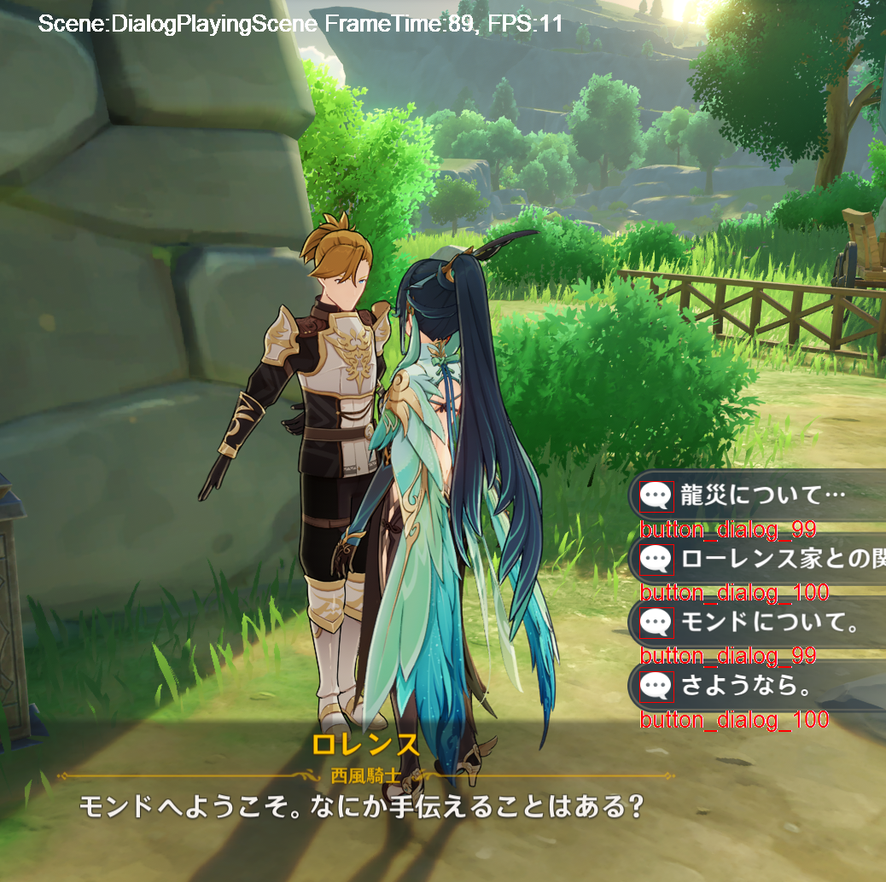

# ok-script

This project aims to provide a universal framework for developing automation tool for PC/Android games, running in
windows,
emulator, or physical Android Phone. Currently still working in progress, there is a working

## Showcase



## Example Usage

Basically you only need to write the Tasks and Scenes, the autoui framework will do all the heavy lifting.
[genshin/main.py](genshin/main.py)

```python
# Defining game scenes to handle different in-game situations through automated tasks
task_executor.scenes.extend([
    WorldScene(interaction, feature_set),
    StartScene(interaction, feature_set),
    MonthlyCardScene(interaction, feature_set),
    DialogCloseButtonScene(interaction, feature_set),
    DialogChoicesScene(interaction, feature_set),
    DialogPlayingScene(interaction, feature_set),
    BlackDialogScene(interaction, feature_set),
])

# Adding automated tasks for gameplay, such as dialog navigation and item collection
task_executor.tasks.extend([
    AutoPlayDialogTask(interaction, feature_set),  # speeding up the dialogs
    AutoChooseDialogTask(interaction, feature_set),  # choose dialog options
    AutoPickTask(interaction, feature_set),  # pickup items in world scene
    AutoLoginTask(interaction, feature_set),  # auto login and claim rewards
])
```

## Scenes

## Tasks

## Project Structure

- `autoui`: Framework code.
- `genshin`: Example Genshin Impact automation project
