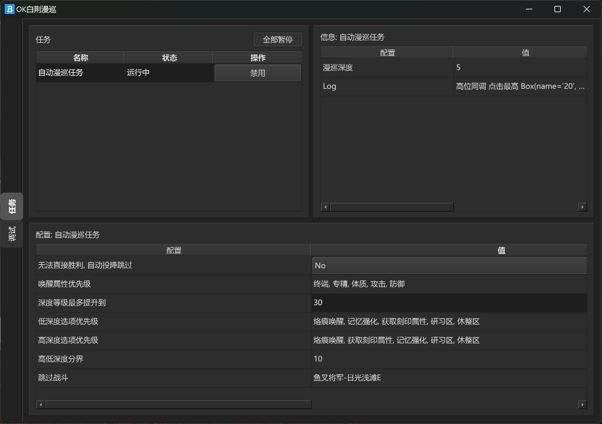
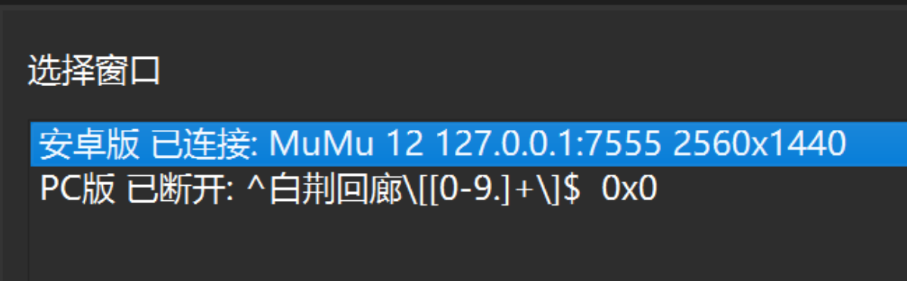

#  ok_baijing

白荆自动漫巡辅助脚本


* 基于[ok-script](https://github.com/ok-oldking/ok-script)开发, 完全使用OCR文字识别开发, 仅有约300行代码
* 支持PC版, 以及安卓模拟器或使用adb连接的安卓物理机
* 可以选择路线分支优先级, 可后半前半使用不同的优先级
* 可以设定最高提升深度
* 可以设定自动跳过无法直接胜利的战斗 (用于快速刷分)
* 可以设定唤醒选择的属性优先级

## 使用方法

### windows版本运行

1. 从[Github Release](https://github.com/ok-oldking/ok_baijing/releases)下载最新版, 双击运行.exe, Windows Defender可能会报警,
   点击忽略
2. 运行需要先选择窗口, 需要先打开PC版或安卓版
   
3. 进入漫巡界面, 设置全部为简化, 如果已经设置为简化,
   
4. 进入漫巡界面, 保证显示追踪
   
5. 点击全部开始
   

### 注意事项

* PC版游戏窗口必须处于前台脚本才会运行, 不支持后台挂机
* PC版脚本程序必须右键管理员运行, 否则没有权限点击窗口
* 安卓版支持后台挂机, 最好不要使用管理员运行, 否则可能侦测不到模拟器
* 安卓版可以识别主流模拟器, 以及可以通过ADB查找到的设备

### Python源码运行和开发

```
pip install -r requirements.txt
python main.py
```

* main_debug.py 是开启debug日志的, 以及OverlayView(如果是模拟器,需要把模拟器窗口重命名为"ok_debug")
* main_debug_console.py 是未开启gui界面的版本
* 默认使用CPU进行OCR, 识别耗时大约300-400ms, 如果要使用GPU, 请参见RapidOCR文档, 安装GPU版依赖

### 常见的问题

#### 1. 分辨率支持

由于都是按窗口百分比计算的, 理论上支持不太夸张的分辨率, 不过只测试过16:9

#### 2. 发现Bug怎么办

可以直接提ISSUE, 附上截图和日志, 日志在logs文件夹

#### 3. 是否免费

一直免费, 我还没退坑的话, 就会一直更新

  
